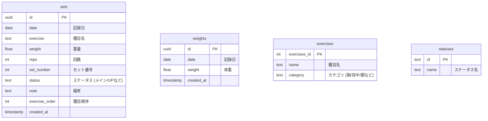

# システム設計書: Training Log

## 1. システム概要
本システムは、日々の筋力トレーニングの内容（種目、重量、レップ数など）と体重を記録し、その推移を可視化することで、利用者のトレーニング進捗管理を支援するWebアプリケーションである。

## 2. 技術スタック & アーキテクチャ

### フロントエンド
- **フレームワーク**: Next.js 15 (App Router)
- **言語**: TypeScript
- **スタイリング**: Tailwind CSS
- **UIライブラリ**: Chart.js (react-chartjs-2)
- **日付処理**: date-fns
- **CSV処理**: PapaParse

### バックエンド / データベース
- **BaaS**: Supabase
- **データベース**: PostgreSQL

## 3. ディレクトリ構成 (`src/`)

- **`app/`**: アプリケーションのページルーティングとレイアウト
    - `page.tsx`: ダッシュボード（BIG3最新記録、今日の記録）
    - `workout/`: 筋トレ記録画面
    - `weight/`: 体重記録画面
    - `chart/`: グラフ表示画面
    - `history/`: 履歴確認画面
    - `master/`: マスタデータ管理（種目など）
    - `csv/`: CSV入出力
- **`components/`**: 再利用可能なReactコンポーネント
- **`lib/`**: 外部サービス設定、ユーティリティ関数（Supabaseクライアントなど）
- **`types/`**: アプリケーション共通の型定義

## 4. データモデル (ER図)

## 5. 機能一覧

| 機能 | パス | 説明 |
| :--- | :--- | :--- |
| **ダッシュボード** | `/` | BIG3（ベンチプレス、スクワット、デッドリフト）の最新記録と、当日のトレーニング記録を表示。 |
| **筋トレ記録** | `/workout` | トレーニングのセットごとの記録（重量、レップス、メモ）を入力・保存する。 |
| **体重記録** | `/weight` | 日々の体重を入力・保存する。 |
| **グラフ表示** | `/chart` | トレーニングのボリューム、最大重量、推定1RM、および体重の推移をグラフで可視化する。 |
| **履歴表示** | `/history` | 過去のトレーニング記録を一覧表示する。 |
| **マスタ管理** | `/master` | トレーニング種目やステータスの追加・編集を行う。 |
| **CSV出力** | `/csv` | 記録データをCSV形式でエクスポート、またはインポートする。 |
