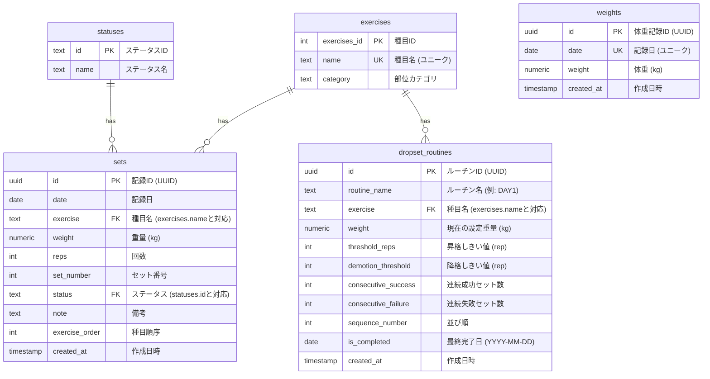

# データベース設計書 (dbSchema)

本ドキュメントは、「Training Log」アプリケーションが使用するデータベース（Supabase/PostgreSQL）の構造、各テーブルの定義、およびそれらのリレーションシップについて説明します。

---

## 1. Entity Relationship (ER) 図

---

## 2. テーブル定義詳細

### 2.1 exercises (種目マスタ)
トレーニング種目を管理するマスタテーブルです。

| カラム名 (物理名) | 論理名 | データ型 | PK/FK | Null | 初期値 | 説明 |
| :--- | :--- | :--- | :---: | :---: | :--- | :--- |
| `exercises_id` | 種目ID | integer | PK | NO | - | マスタ内の一意な数値ID（ソートに使用） |
| `name` | 種目名 | text | UK | NO | - | 種目の名称（例: `ベンチプレス`, `スクワット`） |
| `category` | カテゴリ | text | - | NO | - | 対象となる体の部位（例: `胸`, `背中`, `脚`, `肩`, `腕`） |

### 2.2 statuses (ステータスマスタ)
トレーニングのセット種別（メイン、ウォームアップ等）を管理するマスタテーブルです。

| カラム名 (物理名) | 論理名 | データ型 | PK/FK | Null | 初期値 | 説明 |
| :--- | :--- | :--- | :---: | :---: | :--- | :--- |
| `id` | ステータスID | text | PK | NO | - | ステータスの識別コード（例: `メイン`, `UP`, `レストポーズ`） |
| `name` | ステータス名 | text | - | NO | - | 画面表示用の名称 |

### 2.3 sets (トレーニングセット記録)
日々のトレーニング結果をセット単位で詳細に記録するトランザクションテーブルです。

| カラム名 (物理名) | 論理名 | データ型 | PK/FK | Null | 初期値 | 説明 |
| :--- | :--- | :--- | :---: | :---: | :--- | :--- |
| `id` | 記録ID | uuid | PK | NO | `gen_random_uuid()` | レコードの一意な識別子 |
| `date` | 記録日 | date | - | NO | - | トレーニングを実施した日付 (YYYY-MM-DD) |
| `exercise` | 種目名 | text | FK | NO | - | `exercises.name` と対応する種目名 |
| `weight` | 重量 | numeric | - | NO | - | 使用した器具の重量 (kg) |
| `reps` | 回数 | integer | - | NO | - | 1セットで動作を繰り返した回数 |
| `set_number` | セット番号 | integer | - | YES | `null` | メインセット時のセット順（UPやその他の場合はNull） |
| `status` | ステータス | text | FK | NO | - | `statuses.id` と対応するセット種別 |
| `note` | 備考 | text | - | YES | - | トレーニング時の気付きやメモ |
| `exercise_order`| 種目順序 | integer | - | NO | - | その日に実施したトレーニングの中での順序番号 |
| `created_at` | 作成日時 | timestamp | - | NO | `now()` | レコードの作成日時 |

### 2.4 weights (体重記録)
日々の体重を記録するトランザクションテーブルです。1日1件の登録に制限されます。

| カラム名 (物理名) | 論理名 | データ型 | PK/FK | Null | 初期値 | 説明 |
| :--- | :--- | :--- | :---: | :---: | :--- | :--- |
| `id` | 体重記録ID | uuid | PK | NO | `gen_random_uuid()` | レコードの一意な識別子 |
| `date` | 記録日 | date | UK | NO | - | 体重を測定した日付 (YYYY-MM-DD、ユニーク制約) |
| `weight` | 体重 | numeric | - | NO | - | 測定された体重 (kg) |
| `created_at` | 作成日時 | timestamp | - | NO | `now()` | レコードの作成日時 |

### 2.5 dropset_routines (短時間用筋トレ/ドロップセットルーチン)
短時間用のトレーニングルーチンテンプレートおよび、プログレッシブオーバーロード（重量自動調整）の進捗状況を管理するテーブルです。

| カラム名 (物理名) | 論理名 | データ型 | PK/FK | Null | 初期値 | 説明 |
| :--- | :--- | :--- | :---: | :---: | :--- | :--- |
| `id` | ルーチンID | uuid | PK | NO | `gen_random_uuid()` | レコードの一意な識別子 |
| `routine_name` | ルーチン名 | text | - | NO | - | ルーチンのグループ名（例: `DAY1`, `DAY2`） |
| `exercise` | 種目名 | text | FK | NO | - | `exercises.name` と対応する種目名 |
| `weight` | 現在の重量 | numeric | - | NO | - | 次回セッションで挑戦する設定重量 (kg) |
| `threshold_reps`| 昇格しきい値 | integer | - | NO | - | 重量アップ判定を行うための基準レップ数 |
| `demotion_threshold`| 降格しきい値 | integer | - | NO | - | 重量ダウン判定を行うための基準レップ数 |
| `consecutive_success`| 連続成功回数 | integer | - | NO | `0` | 昇格しきい値以上のレップ数を達成した連続セッション数 |
| `consecutive_failure`| 連続失敗回数 | integer | - | NO | `0` | 降格しきい値未満のレップ数だった連続セッション数 |
| `sequence_number`| 並び順 | integer | - | NO | - | ルーチン内で実施する種目の順序 |
| `is_completed` | 最終完了日 | date | - | YES | `null` | 本日この種目が完了した際の日付 (YYYY-MM-DD) |
| `created_at` | 作成日時 | timestamp | - | NO | `now()` | レコードの作成日時 |
