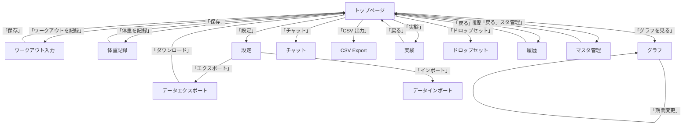

# 画面仕様書 (Screen Specification)

このドキュメントは **training‑log** アプリケーションの全画面一覧、画面遷移図、各画面の詳細仕様を日本語でまとめたものです。アプリは **Next.js (App Router)** をベースに、Supabase と連携したトレーニング記録・体重管理ツールです。

---

## 目次
1. [画面一覧](#画面一覧)  
2. [画面遷移図](#画面遷移図)  
3. [個別画面詳細](#個別画面詳細)
   - [トップページ (Home)](#トップページ-home)
   - [ワークアウト入力ページ (Workout Form)](#ワークアウト入力ページ-workout-form)
   - [体重記録ページ (Weight Log)](#体重記録ページ-weight-log)
   - [グラフ表示ページ (Chart)](#グラフ表示ページ-chart)
   - [設定ページ (Settings)](#設定ページ-settings)
   - [データエクスポートページ (Export)](#データエクスポートページ-export)
   - [データインポートページ (Import)](#データインポートページ-import)
   - [チャットページ (Chat)](#チャットページ-chat)
   - [CSV 出力ページ (CSV Export)](#csv-出力ページ-csv-export)
   - [実験ページ (Develop)](#実験ページ-develop)
   - [ドロップセットページ (Dropset)](#ドロップセットページ-dropset)
   - [履歴ページ (History)](#履歴ページ-history)
   - [マスタ管理ページ (Master)](#マスタ管理ページ-master)
4. [エラーハンドリング・バリデーション](#エラーハンドリングバリデーション)
5. [アクセシビリティ & UI ガイドライン](#アクセシビリティ--ui-ガイドライン)

---

## 画面一覧
| 画面 | パス (URL) | 主な機能 | 補足 |
|------|------------|----------|------|
| **トップページ (Home)** | `/` | 今日のワークアウトサマリ、BIG3 前回記録、体重・体脂肪概況 | アプリ起動時のハブ。API 呼び出しは `app/topPageUtil.ts` を経由 |
| **ワークアウト入力ページ (Workout Form)** | `/workout` | エクササイズ選択、セット/レップ入力、ドロップセット自動ロジック | `src/app/workout/hooks/useWorkoutForm.ts` にて自動入力/バリデーション実装 |
| **体重記録ページ (Weight Log)** | `/weight` | 体重・体脂肪率入力、前日比・前月比計算 | 1日1件制限、既存データは上書き更新 |
| **グラフ表示ページ (Chart)** | `/chart` | 重量・体重・1RM 推移グラフ、期間別集計 | `src/app/chart/hooks/useChartData.ts` がデータ加工 |
| **設定ページ (Settings)** | `/settings` | Supabase 接続情報、テーマ切替、データ削除 | ユーザー設定はローカルストレージに永続化 |
| **データエクスポートページ (Export)** | `/export` | CSV/JSON エクスポート、バックアップ取得 | エクスポートはサーバーサイド API で生成 |
| **データインポートページ (Import)** | `/import` | CSV/JSON インポート、過去データ復元 | バリデーションは `src/app/api/import/` に実装 |
| **チャットページ (Chat)** | `/chat` | AI コーチングチャットインターフェイス |
| **CSV 出力ページ (CSV Export)** | `/csv` | CSV/JSON エクスポート、バックアップ取得 |
| **実験ページ (Develop)** | `/develop` | 開発中の実験機能やプロトタイプ |
| **ドロップセットページ (Dropset)** | `/dropset` | 短時間筋トレ記録、ドロップセットロジック実装 |
| **履歴ページ (History)** | `/history` | 過去のトレーニング記録一覧 |
| **マスタ管理ページ (Master)** | `/master` | 種目やカテゴリのマスタ管理 |

---

## 画面遷移図

---

## 個別画面詳細

### トップページ (Home)
- **URL**: `/`
- **コンポーネント**: `src/app/page.tsx`
- **表示項目**
  - 今日のワークアウト概況（前回実施日、未完了セット数）
  - BIG3（ベンチ、デッドリフト、スクワット）最新重量・前回記録日
  - 体重・体脂肪率サマリ（前日比・前月比）
- **データ取得**: `app/topPageUtil.ts` の `fetchHomeData()` が Supabase から必要テーブルをまとめて取得。
- **インタラクション**
  - ボタン `記録を開始` → `/workout`
  - ボタン `体重を記録` → `/weight`
  - ボタン `グラフを見る` → `/chart`
  - ボタン `設定` → `/settings`
  - ボタン `チャット` → `/chat`
  - ボタン `CSV 出力` → `/csv`
- **UI**: ダークモード対応、カードレイアウトで情報を区切る。マテリアルデザイン風シャドウとグラデーションでプレミアム感を演出。

---

### ワークアウト入力ページ (Workout Form)
- **URL**: `/workout`
- **コンポーネント**: `src/app/workout/page.tsx`
- **主要フック**: `useWorkoutForm.ts`
- **フロー**
  1. エクササイズ選択（プルダウン / オートコンプリート）。選択に応じて `exerciseId` が取得。
  2. セット数・レップ数入力欄が動的に生成。デフォルトは前回記録と同等。
  3. **ドロップセットロジック**: 2 連続成功 → 重量 +2.5kg、2 連続失敗 → 重量 -2.5kg（`dropset/utils/dropsetLogic.ts`）
  4. **自動入力**: `calculatePartDaysAgo` により BIG3 の部位マッピングが自動補完。
  5. 保存ボタン → Supabase `workout_logs` テーブルへ INSERT。成功時はトップページへリダイレクト。
- **バリデーション**
  - 重量は数値かつ正の整数
  - レップ数は 1〜30 の範囲
  - 必須項目が未入力の場合はエラーメッセージ（赤テキスト）を表示
- **UX**: 入力完了後の自動フォーカス遷移、入力欄のプレースホルダーでガイダンス、入力エラー時はフィールドが赤枠。

---

### 体重記録ページ (Weight Log)
- **URL**: `/weight`
- **コンポーネント**: `src/app/weight/page.tsx`
- **ロジック**: `src/app/weight/utils/weightCalculations.ts`
- **機能**
  - 体重・体脂肪率入力（小数点第一位まで）
  - 前日比・前月比自動計算（期間差分が格納された `weight_comparisons` ビューを参照）
  - **1 日 1 件** の制約：同日データが存在すれば UPDATE、なければ INSERT。
- **UI**: カード形式で入力欄と比較結果を同一画面に配置。保存後は緑のスナックバーで「保存完了」を表示。

---

### グラフ表示ページ (Chart)
- **URL**: `/chart`
- **コンポーネント**: `src/app/chart/page.tsx`
- **データ取得**: `useChartData.ts` が期間・種別（重量、体重、1RM）ごとに集計データを返す。
- **表示**
  - 折れ線グラフ（Plotly または Chart.js）で重量・体重・1RM を可視化
  - 期間選択タブ（1 週間、1 ヶ月、3 ヶ月、12 ヶ月）
  - ツールチップに具体的な数値と日付を表示
- **インタラクション**
  - データ点クリックでモーダル表示（詳細レコードへのリンク）
  - 「エクスポート」ボタン → CSV ダウンロード
- **デザイン**: ガラスモーフィズム背景、滑らかなトランジション、ホバー時にポイントが拡大するマイクロアニメーション。

---

### 設定ページ (Settings)
- **URL**: `/settings`
- **コンポーネント**: `src/app/settings/page.tsx`
- **項目**
  - **テーマ**: ライト / ダーク自動切替（OS 設定に追従）
  - **Supabase 接続情報**: URL と anon key（隠蔽表示）
  - **データ削除**: 「すべての記録を削除」ボタン（二段階確認）
  - **バックアップ**: エクスポートページへのショートカットリンク
- **アクセシビリティ**: 各スイッチは ARIA ラベル付き、フォーカスインジケータが明示的。

---

### データエクスポートページ (Export)
- **URL**: `/export`
- **コンポーネント**: `src/app/export/page.tsx`
- **機能**: CSV/JSON エクスポート、トレーニングデータのバックアップ取得。ファイルは `training-log_YYYYMMDD.zip` としてダウンロード。

---

### データインポートページ (Import)
- **URL**: `/import`
- **コンポーネント**: `src/app/import/page.tsx`
- **機能**: CSV/JSON インポート、過去データ復元。バリデーションは `src/app/api/import/` に実装。重複レコードは `ON CONFLICT DO UPDATE` で上書き。

---

### チャットページ (Chat)
- **URL**: `/chat`
- **コンポーネント**: `src/app/chat/page.tsx`
- **機能**: AI コーチングチャットインターフェイス。ユーザーの質問に対し、トレーニングアドバイスやデータ分析結果を提供。

---

### CSV 出力ページ (CSV Export)
- **URL**: `/csv`
- **コンポーネント**: `src/app/csv/page.tsx`
- **機能**: CSV/JSON エクスポート、トレーニングデータのバックアップ取得。ファイルは `training-log_YYYYMMDD.zip` としてダウンロード。

---

### 実験ページ (Develop)
- **URL**: `/develop`
- **コンポーネント**: `src/app/develop/page.tsx`
- **目的**: 開発中の実験的機能や UI プロトタイプを置く領域。

---

### ドロップセットページ (Dropset)
- **URL**: `/dropset`
- **コンポーネント**: `src/app/dropset/page.tsx`
- **機能**: 短時間筋トレ記録、ドロップセットロジック実装。

---

### 履歴ページ (History)
- **URL**: `/history`
- **コンポーネント**: `src/app/history/page.tsx`
- **機能**: 過去のトレーニング記録一覧表示。

---

### マスタ管理ページ (Master)
- **URL**: `/master`
- **コンポーネント**: `src/app/master/page.tsx`
- **機能**: 種目やカテゴリのマスタデータ管理。

---

## エラーハンドリング・バリデーション
- **共通エラー表示コンポーネント**: `components/ErrorToast.tsx`（赤背景、スライドイン）
- **API エラー**: HTTP 5xx はリトライロジック（最大 3 回）
- **フォームバリデーション**: Zod スキーマで型安全に定義、`react-hook-form` と連携
- **データ不整合**: `src/app/api/validate/` がバックエンドで定期実行し、`/settings` に警告バッジを表示

---

## アクセシビリティ & UI ガイドライン
- **カラーコントラスト**: WCAG AA 以上（例: ダークモード文字色 #E0E0E0、背景 #1E1E1E）
- **フォント**: Google Fonts `Inter`（500・600 ウェイト）全体で使用
- **フォーカス順序**: キーボードだけで全操作可能、`tabindex` 明示的設定
- **マイクロアニメーション**: ボタンホバー時に 0.2s のスケールアップ、入力エラー時にシェイクアニメーション
- **レスポンシブ**: モバイルは 1 カラム、デスクトップは 2 カラムカードレイアウト

---

## 変更履歴
| 日付 | 作成者 | 内容 |
|------|--------|------|
| 2026-05-25 | AI (Antigravity) | screen.md を現行コードベースに合わせて統合・整理。新規ページ (Chat, CSV, Develop, Dropset, History, Master) を追加し、重複セクションを除去。

---

以上が **training‑log** アプリケーションの画面仕様です。必要に応じて UI プロトタイプを作成し、デザインレビューを行うことを推奨します。
